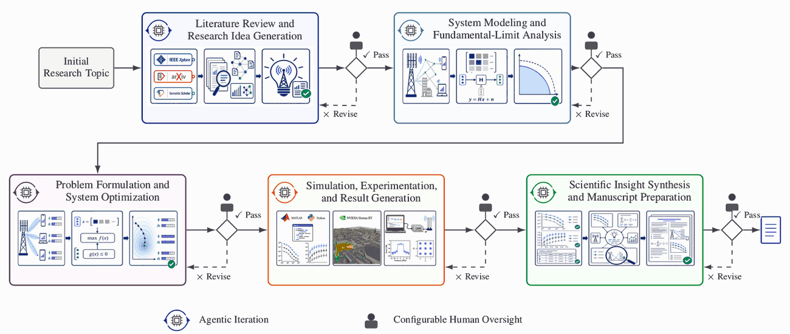

<div align="center">

# Trustworthy Wireless AutoResearch

### From a broad wireless topic to an evidence-grounded research manuscript

[English](README.md) | [中文](README.zh-CN.md)

<p>
  <a href="LICENSE"></a>
  
  
  
</p>

Starting from **“ISAC for UAVs,”** this repository records an end-to-end research evidence trail spanning literature grounding, idea generation, physical modeling, optimization, simulation, evidence synthesis, and manuscript-level evaluation.

[Framework](Trustworthy_Wireless_AutoResearch_Framework.pdf) · [70-Idea Report](Literature_Review_and_Research_Idea_Generation/00_overall_70_idea_report.pdf) · [Selected Topic](Selected_Research_Topic.pdf) · [Case-Study Manuscript](Near_Field_ISAC_for_Six_Dimensional_UAV_Pose_Estimation.pdf) · [Simulation Results](Simulation_Experimentation_and_Result_Generation/)

<a href="Trustworthy_Wireless_AutoResearch_Framework.pdf">
  
</a>

<sub>At each human-check gate, an artifact that requires revision returns to the current stage, while an accepted artifact passes to the next stage. Click the animation to open the vector PDF.</sub>

</div>

## 🧭 At a Glance

| Starting point | Literature evidence | Candidate space | Evaluation | Featured outcome |
|---|---:|---:|---|---|
| ISAC for UAVs | 434 retrieved records | 70 research topics | 8 weighted criteria | Near-field ISAC for six-dimensional UAV pose estimation |

The repository is organized as an **evidence trail**, rather than a loose collection of generated documents. Each stage produces inspectable artifacts and can pass, revise, or return to an earlier stage under configurable human oversight.

## 🔬 The Five-Stage Evidence Trail

| Stage | Research question | Evidence in this repository |
|---|---|---|
| **1. Literature review and idea generation** | What is worth studying, and is the gap defensible? | [Surveyed literature corpus](Surveyed_Literature_Corpus_for_UAV_ISAC.pdf), [70-idea report](Literature_Review_and_Research_Idea_Generation/00_overall_70_idea_report.pdf), [ranking](UAV_ISAC_Research_Topic_Ranking.pdf), [component scores](UAV_ISAC_Component_Scores.pdf), and [70 individual idea briefs](Literature_Review_and_Research_Idea_Generation/candidate_research_ideas/) |
| **2. System modeling and fundamental-limit analysis** | Can the proposed claim exist under the stated physics and nuisance parameters? | [Selected research problem](Selected_Research_Topic.pdf) and the modeling/CRB sections of the [case-study manuscript](Near_Field_ISAC_for_Six_Dimensional_UAV_Pose_Estimation.pdf) |
| **3. Problem formulation and system optimization** | How should communication and sensing resources be allocated? | Pose-aware formulation, identifiability analysis, SDP reformulation, and estimator design in the [case-study manuscript](Near_Field_ISAC_for_Six_Dimensional_UAV_Pose_Estimation.pdf) |
| **4. Simulation, experimentation, and result generation** | Do the analytical, algorithmic, and baseline results agree under matched conditions? | [Rate-pose tradeoff](Simulation_Experimentation_and_Result_Generation/fig_rate_pose_tradeoff.pdf), [position RMSE](Simulation_Experimentation_and_Result_Generation/fig_position_rmse.pdf), [orientation RMSE](Simulation_Experimentation_and_Result_Generation/fig_orientation_rmse.pdf), and [landing trajectory](Simulation_Experimentation_and_Result_Generation/fig_landing_trajectory.pdf) |
| **5. Scientific insight synthesis and manuscript preparation** | Are the final claims supported and positioned against closely related work? | [Final case-study manuscript](Near_Field_ISAC_for_Six_Dimensional_UAV_Pose_Estimation.pdf) and [IEEE conference/letter comparison table](Compared_IEEE_Conference_and_Letter_Papers.pdf) |

## ✈️ Featured Case Study

### Near-Field ISAC for Six-Dimensional UAV Pose Estimation During Landing

The selected study considers a monostatic XL-array base station that maintains a communication link while probing calibrated coded landmarks on a landing UAV. Exact spherical-wave responses and rigid-body geometry couple three-dimensional position and three-dimensional orientation into a unified pose-estimation problem.

The manuscript develops:

- a nuisance-aware pose information analysis and Cramér-Rao bound;
- a local-identifiability condition for six-dimensional pose recovery;
- a pose-aware communication-sensing power-allocation formulation; and
- a variable-projection estimator for absolute UAV pose recovery.

## 📚 Artifact Directory

| Artifact | Purpose |
|---|---|
| [Framework overview](Trustworthy_Wireless_AutoResearch_Framework.pdf) | End-to-end five-stage workflow, validation gates, and human oversight |
| [Complete 70-idea report](Literature_Review_and_Research_Idea_Generation/00_overall_70_idea_report.pdf) | Ranked list of all candidate UAV-ISAC research topics |
| [Candidate idea archive](Literature_Review_and_Research_Idea_Generation/candidate_research_ideas/) | One concise PDF brief for each of the 70 ideas |
| [Topic ranking](UAV_ISAC_Research_Topic_Ranking.pdf) | Compact rank-score-topic table |
| [Component-score landscape](UAV_ISAC_Component_Scores.pdf) | Eight-dimensional evaluation breakdown |
| [Surveyed literature corpus](Surveyed_Literature_Corpus_for_UAV_ISAC.pdf) | Searchable evidence base used during idea generation |
| [Case-study manuscript](Near_Field_ISAC_for_Six_Dimensional_UAV_Pose_Estimation.pdf) | Integrated research output developed from the selected topic |
| [Published-paper comparison](Compared_IEEE_Conference_and_Letter_Papers.pdf) | Five IEEE ICC/GLOBECOM papers and five IEEE letters used for comparison |
| [Simulation result figures](Simulation_Experimentation_and_Result_Generation/) | Four manuscript-reported numerical result figures |

## 🗂️ Repository Map

```text
.
├── Trustworthy_Wireless_AutoResearch_Framework.pdf
├── Literature_Review_and_Research_Idea_Generation/
│   ├── 00_overall_70_idea_report.pdf
│   └── candidate_research_ideas/          # Rank 01–70
├── Selected_Research_Topic.pdf
├── UAV_ISAC_Research_Topic_Ranking.pdf
├── UAV_ISAC_Component_Scores.pdf
├── Surveyed_Literature_Corpus_for_UAV_ISAC.pdf
├── Near_Field_ISAC_for_Six_Dimensional_UAV_Pose_Estimation.pdf
├── Compared_IEEE_Conference_and_Letter_Papers.pdf
├── Simulation_Experimentation_and_Result_Generation/
├── assets/
├── LICENSE
└── THIRD_PARTY_NOTICES.md
```

## 📄 License and Attribution

This repository brings together the wireless AutoResearch framework, the surveyed literature corpus, 70 candidate research ideas and their evaluation tables, the selected near-field UAV-ISAC case-study manuscript, the published-paper comparison table, and the manuscript-reported simulation result figures.

Except where otherwise noted, original materials in this repository for which **TrustworthyWirelessAutoResearch@CUHK SZ** holds the necessary rights are licensed under the [Creative Commons Attribution 4.0 International License](LICENSE). Reuse requires appropriate attribution, a link to the license, and an indication of whether changes were made. See the [third-party notices](THIRD_PARTY_NOTICES.md) for material governed by separate rights or terms.

Suggested attribution: *Trustworthy Wireless AutoResearch*, **TrustworthyWirelessAutoResearch@CUHK SZ**, 2026, [GitHub repository](https://github.com/guoyuan-dotcom/TrustworthyWirelessAutoResearch).

The manuscript-level review workflow builds on the review agent available in [WARA](https://github.com/guoyuan-dotcom/WARA_CUHKSZ).
